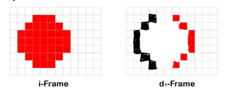

1.
herunterskalieren auf 720
2.
nein
3.
4:4:4 -> 0%
4:2:2 -> 33.33%
4:1:1 -> 50%
4:2:0 -> 50%
4.
Weil die Y-Layer, die für die Bilschärfe zuständig ist, nicht verkleinert wird.
5.
Weil sich die Pixel in einem Block einander angleichen und sich die verschiedenen blöcke unterschiedlich angleichen.
6.
GOP -> Group of Pictures
GOP25 -> Ein i-Frame (also ganzes Bild, nicht nur inkrementell) alle 25 Bilder.
7.
A lässt sich besser komprimieren, weil dort viel weniger Änderungen am Bild vorkommen.
8.

