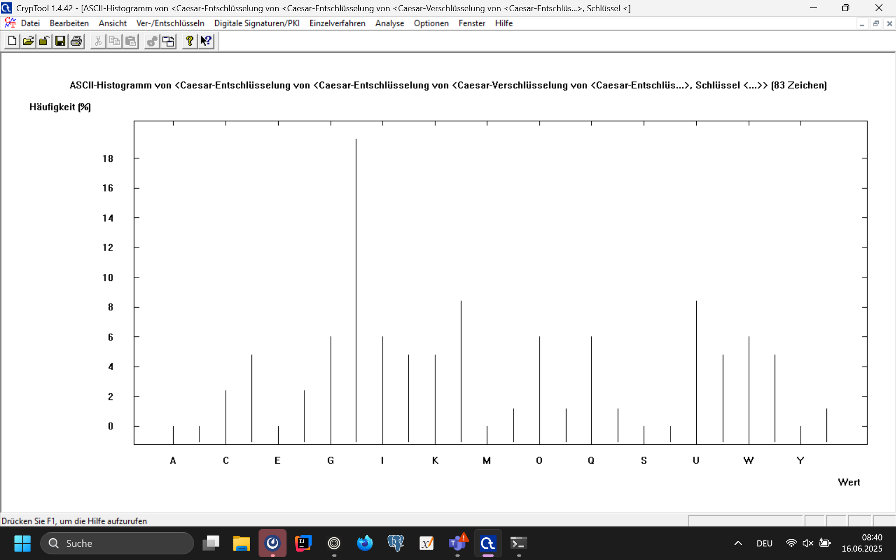
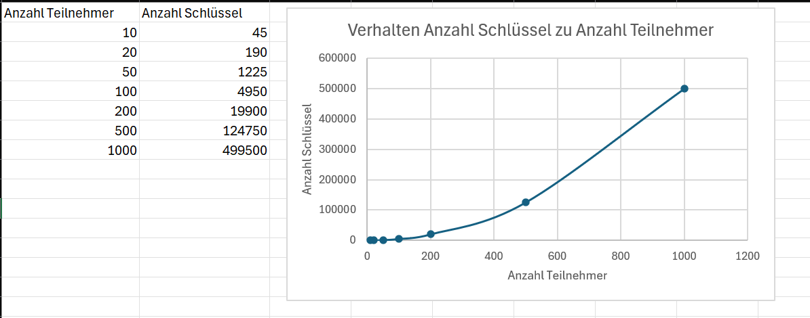

# Ceasar 
## Verschlüsselter Text
GHU DQJULII HUIROJW CXU WHHCHLW GLH ZXHUIHO VLQG
JHIDOOHQ LFK NDP VDK XQG VLHJWH WHLOH XQG KHUUVFKH
## Häufigkeitsanalyse

## Schlüssel
H -> E: Schlüssel 3
## Entschlüsselter Text
DER ANGRIFF ERFOLGT ZUR TEEZEIT DIE WUERFEL SIND
GEFALLEN ICH KAM SAH UND SIEGTE TEILE UND HERRSCHE
# Vigenère
## Verschlüsselung
Text: BEEF
Schlüssel: AFFE
Encrypteter Text: BJJJ
## Entschlüsselung
Encrypteter Text: WRKXQT
Schlüssel: SECRET
Text: ENIGMA
## Key knacken
### Encrypteter Text
USP JHYRH ZZB GTV CJ WQK OCLGQVFQK GAYKGVFGX NS ISBVB MYBC MWCC NS JOEVB GTV
KRQFV AGK XCUSP VFLVBLLBE ESSEILUBCLBXZU SENSWFGVRCES SER CZBCE ILUOLBPYISL
CCSZG VZJ
### Schlüssellänge
3
### Schlüssel
ROY
### Text
DER STAAT BIN ICH ES IST AEUSSERST SCHWIERIG ZU REDEN OHNE VIEL ZU SAGEN ICH
MACHE MIT JEDER ERNENNUNG NEUNUNDNEUNZIG UNZUFRIEDENE UND EINEN UNDANKBAREN
LOUIS XIV
## Key knacken mit langem Key
### Text
DER STAAT BIN ICH ES IST AEUSSERST SCHWIERIG ZU REDEN OHNE VIEL ZU SAGEN ICH
MACHE MIT JEDER ERNENNUNG NEUNUNDNEUNZIG UNZUFRIEDENE UND EINEN UNDANKBAREN
LOUIS XIV
### Key
LoremipsumdolorsitametconsectetueradipiscingelitAeneancommodoligulaegetdolorA
eneanmassaCumsociisnatoquepenatibusetmagnisdisparturientmontesnasceturridicul
usmusDone
### Encrypteter Text
OSI WFIPL VUQ WNV VK QLT MINUGRJWV LGAQMVRLO OC JGLRT SSVX VMRP ZH UOSQB LQS
UGWSE QOX CHRPF VRYSERGVV FYGQIYREWCGZUK NPNHXVKXHXHI LNG MXVWP CAJEYSUAVRR
LBWWE JWY
### Angebliche Schlüssellänge
8
### Angeblicher Schlüssel
NHNRSUCD
### Angeblicher entschlüsselter Text
BLV FNONI IND FVB TH DEG VQTSDECJE TMYNZOEUW UA GTEEC AYTU IFEY HN SLFJO UYY
SDJLR ZWD AEEIS EZEQBEZIE NEENVRENEIEWHD AYVNVSXQUGPO JKT FKEEV AXWXLBCGTOE
EOFEK HTL
### Fazit
Bei einem zu langen Schlüssel bringt die Analyse keine richtigen Ergebnisse mehr
# XOR-Stromchiffre
Ausgangszahl: 4711 -> 1 0010 0110 0111
Schlüssel: 1000 1101

## Verschlüsselung
```
1 0010 0110 0111
1 0001 1011 0001
----------------
0 0011 1101 0110
```
Verschlüsselte Zahl: 0 0011 1101 0110
## Entschlüsselung
```
0 0011 1101 0110
1 0001 1011 0001
----------------
1 0010 0110 0111
```
Entschlüsselte Zahl: 1 0010 0110 0111 -> 4711
# Nachteile synchrone Verschlüsselung

